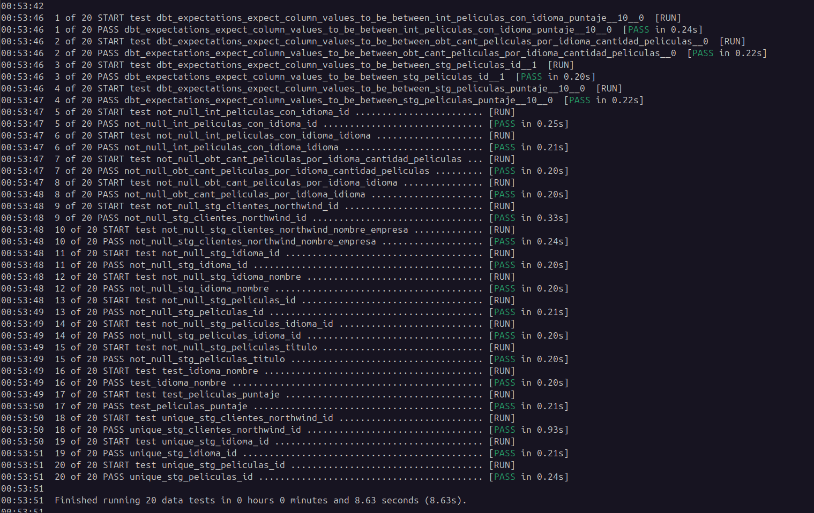
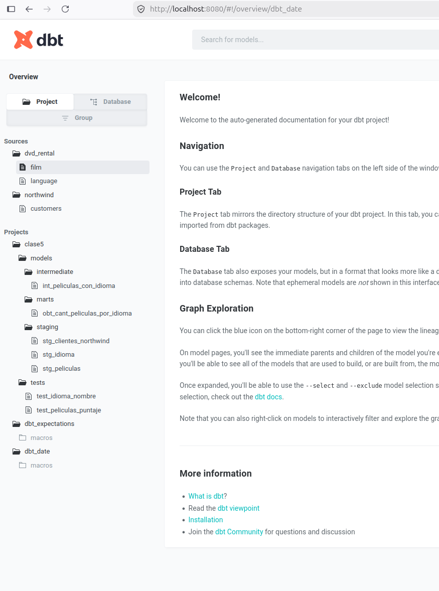
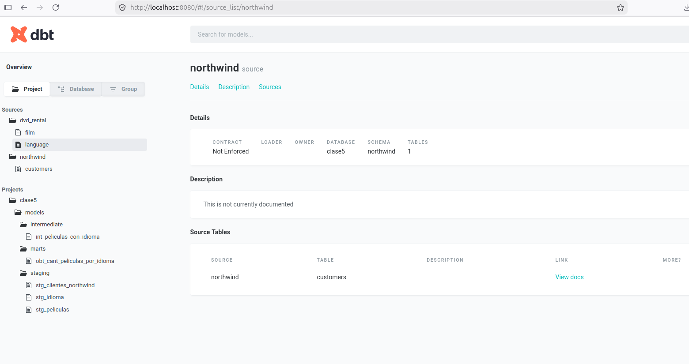
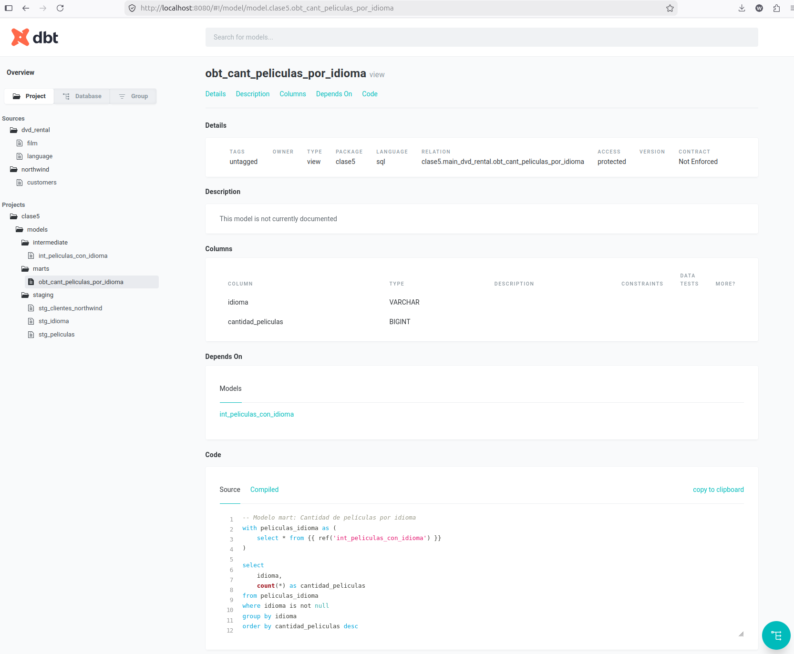

Welcome to tu proyecto dbt!

## Documentación de modelos y columnas clave (Tarea 5)

Todos los modelos y sus columnas principales están documentados en los archivos schema.yml. Esto permite que la documentación generada por dbt sea clara y útil para cualquier usuario del proyecto.

**Ejemplo de documentación:**

**stg_peliculas**
- Modelo staging de películas, renombra y estandariza campos de la tabla film.
	- `id`: Identificador único de la película.
	- `idioma_id`: Identificador del idioma de la película.
	- `titulo`: Título de la película.
	- `puntaje`: Puntaje de la película.

**stg_idioma**
- Modelo staging de idiomas, renombra y estandariza campos de la tabla language.
	- `id`: Identificador único del idioma.
	- `nombre`: Nombre del idioma.

**stg_clientes_northwind**
- Modelo staging de clientes de Northwind.
	- `id`: Identificador único del cliente.
	- `nombre_empresa`: Nombre de la empresa.

**int_peliculas_con_idioma**
- Une películas con su idioma.
	- `id`: Identificador único de la película.
	- `idioma`: Nombre del idioma de la película.
	- `puntaje`: Puntaje de la película.

**obt_cant_peliculas_por_idioma**
- Mart con la cantidad de películas por idioma.
	- `idioma`: Nombre del idioma.
	- `cantidad_peliculas`: Cantidad de películas en ese idioma.


## Fuentes de datos utilizadas

Este proyecto utiliza dos fuentes relacionales públicas:

- [DVD Rental](https://github.com/gordonkwokkwok/DVD-Rental-PostgreSQL-Project) (esquema: dvd_rental)
- [Northwind](https://github.com/pthom/northwind_psql) (esquema: northwind)

Ambas fueron cargadas a la base de datos `clase5` mediante Airbyte.

## Árbol de modelos

```
models/
├── staging/
│   ├── stg_peliculas.sql           # Staging de películas (dvd_rental)
│   ├── stg_idioma.sql              # Staging de idiomas (dvd_rental)
│   └── stg_clientes_northwind.sql  # Staging de clientes (northwind)
├── intermediate/
│   └── int_peliculas_con_idioma.sql    # Join películas con idioma
└── marts/
	└── obt_cant_peliculas_por_idioma.sql # Mart: cantidad de películas por idioma
```

## Ejecución básica

```bash
dbt run
dbt test
```


## Resultados de tests y dashboards

A continuación se muestran capturas de los resultados de los tests y dashboards generados:

### Resultados de tests


### Dashboard de documentación


## DAGs generados por dbt docs (Tarea 6)

A continuación se muestran los DAGs (grafos de dependencias) generados por dbt docs para este proyecto:

### DAG 1


### DAG 2


## Recursos útiles
- Aprende más sobre dbt [en la documentación](https://docs.getdbt.com/docs/introduction)
- Preguntas frecuentes en [Discourse](https://discourse.getdbt.com/)
- Únete al [chat de la comunidad](https://community.getdbt.com/)
- Encuentra [eventos de dbt](https://events.getdbt.com)
- Lee el [blog de dbt](https://blog.getdbt.com/)

# dbt_clase5
